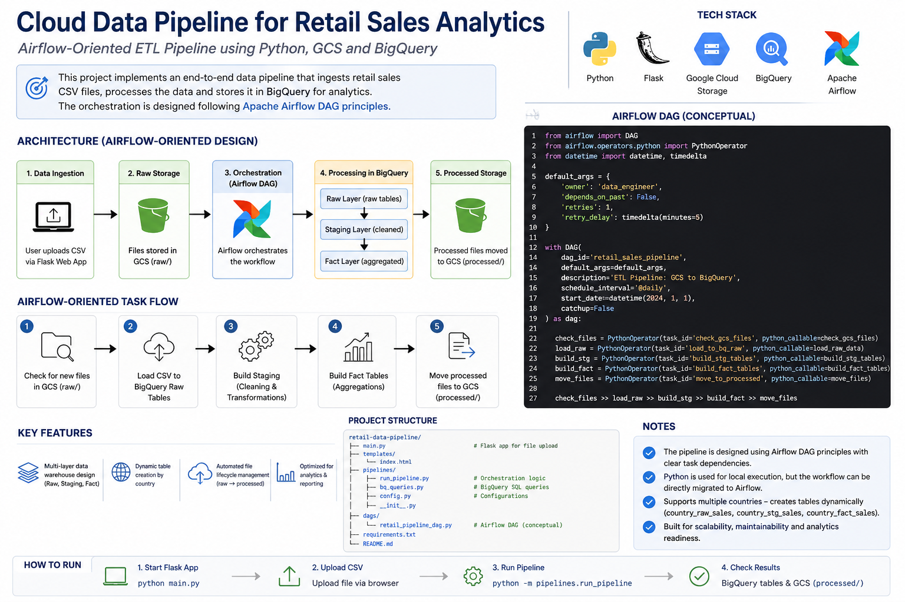
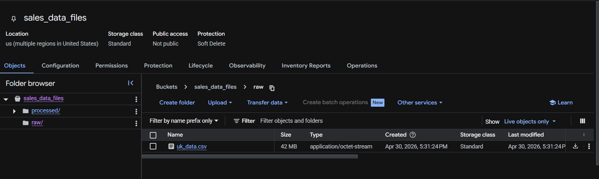
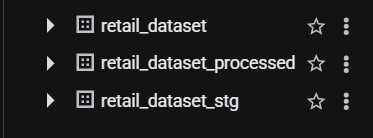
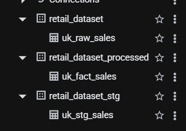
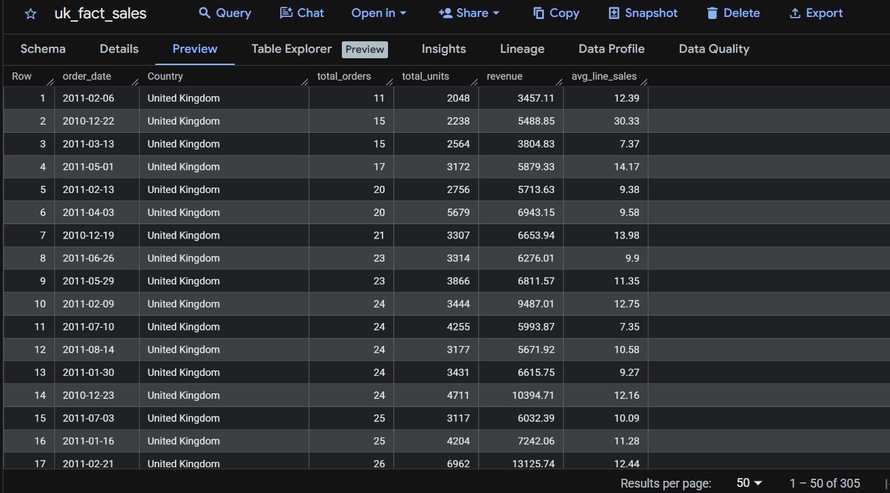
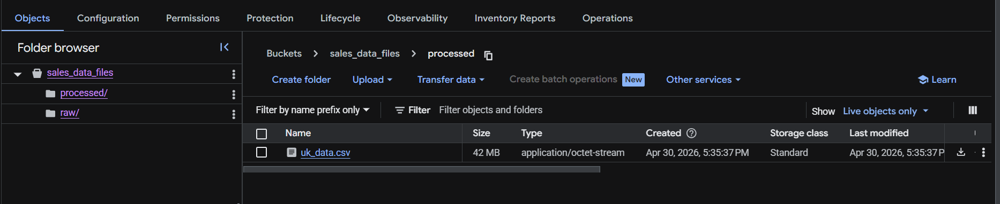

# Cloud Data Pipeline for Retail Sales Analytics

## 📌 Overview

This project implements a cloud-based ETL pipeline that ingests retail sales data, processes it, and stores it in BigQuery for analytics.

## 🏗️ Architecture




```text
User Upload (Flask)
        ↓
Google Cloud Storage (raw/)
        ↓
Python Orchestration Pipeline
        ↓
BigQuery
   ├── retail_dataset (raw)
   ├── retail_dataset_stg (cleaned)
   └── retail_dataset_processed (fact)
        ↓
Processed files moved to GCS (processed/)
```

## 📸 Screenshots

### Flask Upload Portal


### GCS Raw Folder



### BigQuery Datasets



### Processed Tables



### BigQuery Data Preview



### GCS Processed Folder



## ⚙️ Tech Stack

- Python
- Flask
- Google Cloud Storage (GCS)
- BigQuery
- SQL

## 🔄 Pipeline Flow

1. User uploads CSV file through Flask web app
2. File is stored in GCS `raw/` folder
3. Pipeline detects new files
4. Loads data into BigQuery raw tables
5. Applies transformations to create staging tables
6. Builds fact tables for analytics
7. Moves processed files to `processed/`

## ✨ Features

- Multi-layer data warehouse design (raw, staging, fact)
- Dynamic table creation by country
- Automated file lifecycle management
- Cloud-native data processing

## ▶️ How to Run

1. Start Flask app:
   ```bash
   python main.py
   ```
2. Upload CSV file through browser
3. Run pipeline:
   python -m pipelines.run_pipeline

📊 Sample Output
BigQuery tables:
uk_raw_sales
uk_stg_sales
uk_fact_sales

📌 Notes

The pipeline is designed following Apache Airflow DAG principles and can be extended to production-grade orchestration using Airflow.
